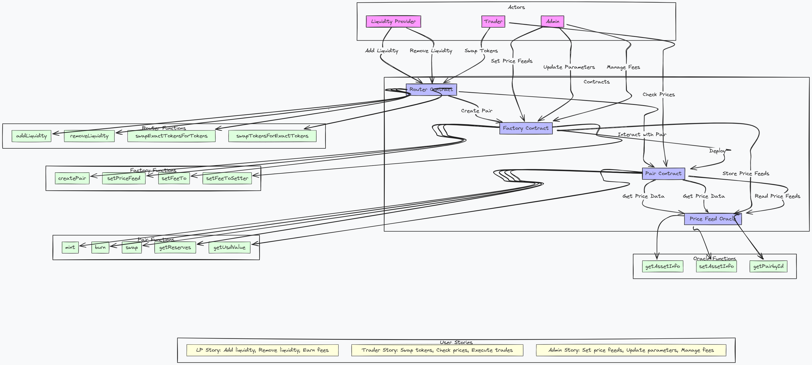

## Contract Addresses

```shell 
== Logs ==
  ifaSwapFactory deployed at: 0x045A543FFf5D816fBA83F8af069a13877C5E6a4B
  IfaSwapRouter deployed at: 0x4C340689308af4354704EF753c264bD1946230B8

```

# IfaSwap Protocol Documentation

## Overview

IfaSwap is a decentralized exchange protocol inspired by Uniswap V2(you can call it a uniswap fork but it id not really a uniswap fork), with additional price feed integrations. It allows users to swap tokens, add/remove liquidity, and earn fees on provided liquidity. The protocol consists of several core contracts that work together to provide decentralized exchange functionality.

## Architecture



## Core Components

### 1. IfaSwapFactory

The Factory contract is the registry for all liquidity pools (pairs) created in the protocol. It:
- Creates new pair contracts for token combinations
- Maintains the mapping of token pairs to their corresponding pair contracts
- Handles fee collection settings
- Manages price feed integrations

### 2. IfaSwapPair

The Pair contract represents a specific liquidity pool between two tokens. It:
- Maintains token reserves and manages liquidity provider tokens
- Executes swap operations
- Calculates USD values using price feed data
- Collects protocol fees
- Implements the ERC20 standard for LP tokens

### 3. IfaSwapRouter

The Router contract provides user-friendly interfaces for common operations. It:
- Facilitates adding and removing liquidity
- Executes token swaps with optimal routing
- Handles ETH wrapping/unwrapping for ETH trades
- Calculates optimal amounts for trades and liquidity provision

### 4. IfaSwapERC20

The ERC20 implementation for liquidity provider tokens, inherited by IfaSwapPair. It:
- Implements standard ERC20 functionality
- Adds support for EIP-2612 permits (gasless approvals)

## Unique Features

### Price Feed Integration

Unlike Uniswap V2, IfaSwap incorporates external price feeds to:
- Calculate token values in USD
- Determine optimal swap amounts
- Provide price reference for liquidity provision

## Key Component 

### IfaSwapPair

The Pair contract is the core of the IfaSwap protocol, maintaining reserves of two tokens and facilitating swaps between them.

#### Key Functions

| Function                           | Description                                            |
| ---------------------------------- | ------------------------------------------------------ |
| `getReserves()`                    | Returns current reserves of both tokens and USD value  |
| `swap(amount0Out, amount1Out, to)` | Executes a swap operation                              |
| `mint(to)`                         | Creates LP tokens when liquidity is added              |
| `burn(to)`                         | Burns LP tokens when liquidity is removed              |
| `getUsdValue(token, amount)`       | Calculates USD value of token amount using price feeds |

#### Swap Process

1. Router calls the Pair's `swap()` function
2. Tokens are transferred to the recipient
3. Input amounts are verified
4. Reserves are updated
5. Events are emitted

#### Fees

- Swap Fee: 0.6% (0.6% on each swap)
  - 0.5% goes to liquidity providers
  - 0.1% can be directed to a protocol fee address (if enabled)

- Fee collection is implemented in the swap calculation and _mintFee function

### IfaSwapRouter

The Router contract handles complex interactions that typically involve multiple steps.

#### Key Functions

| Function                     | Description                                          |
| ---------------------------- | ---------------------------------------------------- |
| `addLiquidity()`             | Adds liquidity to a pair                             |
| `removeLiquidity()`          | Removes liquidity from a pair                        |
| `swapExactTokensForTokens()` | Swaps exact input tokens for output tokens           |
| `swapTokensForExactTokens()` | Swaps tokens for exact output tokens                 |
| `swapExactETHForTokens()`    | Swaps exact ETH for tokens                           |
| `swapTokensForExactETH()`    | Swaps tokens for exact ETH                           |
| `quote()`                    | Calculates equivalent amount based on price feeds    |
| `getAmountsOut()`            | Calculates output amounts for a given input and path |
| `getAmountsIn()`             | Calculates input amount needed for a desired output  |

#### Multi-Hop Swaps

The Router supports multi-hop swaps through an array of tokens:
```solidity
// Example: Swap TokenA for TokenC via TokenB
address[] path = [addressTokenA, addressTokenB, addressTokenC];
router.swapExactTokensForTokens(amountIn, minAmountOut, path, recipient, deadline);
```

## Price Feed Integration

IfaSwap uses our own IfaOracle price feed system:

1. The Factory maintains mappings of tokens to their corresponding assetIds
2. Pair contracts use price feed data to calculate USD values
3. Router uses price feed data to calculate optimal swap amounts

## NOTE to  Integrate (on Frontend )

### Common Scenarios

#### Adding Liquidity

```javascript
// Approve router to spend tokens
await tokenA.approve(routerAddress, amountA);
await tokenB.approve(routerAddress, amountB);

// Add liquidity
await router.addLiquidity(
  tokenAAddress,
  tokenBAddress,
  amountA,
  amountB,
  amountAMin,  // Slippage protection
  amountBMin,  // Slippage protection
  userAddress,
  deadline
);
```

#### Swapping Tokens

```javascript
// Approve router to spend tokens
await tokenIn.approve(routerAddress, amountIn);

// Create path for swap
const path = [tokenInAddress, tokenOutAddress];

// Get expected output
const amountsOut = await router.getAmountsOut(amountIn, path);
const expectedOutput = amountsOut[1];

// Execute swap with slippage protection
await router.swapExactTokensForTokens(
  amountIn,
  expectedOutput * 0.99,  // 1% slippage tolerance
  path,
  userAddress,
  deadline
);
```

#### Removing Liquidity

```javascript
// Approve router to spend LP tokens
await pairContract.approve(routerAddress, liquidity);

// Remove liquidity
await router.removeLiquidity(
  tokenAAddress,
  tokenBAddress,
  liquidity,
  minAmountA,  // Slippage protection
  minAmountB,  // Slippage protection
  userAddress,
  deadline
);
```

### Interface Requirements

Frontend implementations should include:
- Token selection interface
- Liquidity management interface
- Swap interface with path discovery
- Price display using the price feed data
- Slippage controls

## Key Differences from Uniswap V2

1. **Price Feed Integration**: Uses external price feeds rather than just reserve ratios
2. **USD Value Calculation**: Maintains USD values for reserves and calculations
3. **Swap Fee Structure**: 0.6% fee instead of Uniswap's 0.3%
4. **Stale Price Protection**: Checks for price feed staleness to prevent trades with outdated prices


